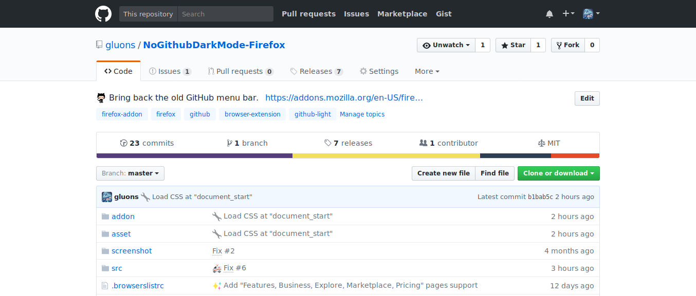

# No GitHub Dark Mode for [Firefox](https://www.mozilla.org/firefox)

A Firefox add-on to change GitHub menu bar back to old color.

Convert from [adamisntdead/NoGithubDarkMode](https://github.com/adamisntdead/NoGithubDarkMode).

---

**:negative_squared_cross_mark: Without `No GitHub Dark Mode`:**

**:white_check_mark: With `No GitHub Dark Mode`:**

---

## Installation

**From [AMO](https://addons.mozilla.org):**

Go to https://addons.mozilla.org/en-US/firefox/addon/no-github-dark-mode/.

**Manually:**

1. Download [this repo as zip file](https://github.com/gluons/NoGithubDarkMode-Firefox/releases/latest).
2. Extract it.
3. Go to `about:debugging#addons` in Firefox.
4. Click on **Load Temporary Add-on**.
5. Select `manifest.json` file in `./extension`.
